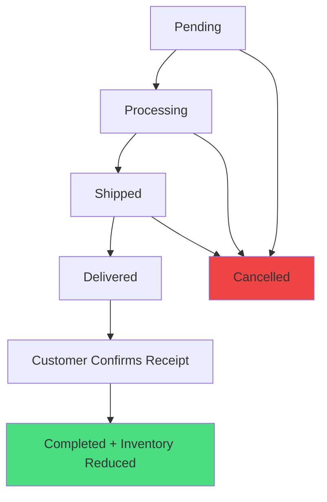

# E-commerce Order Management System - Completion Report

## 📋 Overview
This document outlines the completed implementation of a comprehensive e-commerce order management system with strict order status synchronization, customer order confirmation functionality, and Vietnamese localization for admin interface.

## ✅ Completed Features

### 1. Order Confirmation Flow (Customer Side)
- **Feature**: Customers can confirm order receipt when status is "Delivered"
- **Implementation**: 
  - Frontend: `OrderActions.tsx` with prominent confirmation UI
  - Backend API: `POST /api/orders/{id}/confirm-received`
  - Frontend Proxy: `/api/orders/[orderId]/confirm-received/route.ts`

**Logic Flow:**
1. Order must be in "Delivered" status
2. Customer clicks "Xác nhận đã nhận hàng" button
3. System validates order status and ownership
4. Updates order to "Completed" status
5. Sets payment status to "Paid" and `IsPaid = true`
6. **Decreases product inventory** by order quantities
7. Sends success notification to customer

### 2. Inventory Management
- **Critical Feature**: Automatic inventory deduction on order completion
- **Implementation**: `OrdersController.cs` - `ConfirmOrderReceived` method
- **Logic**: When customer confirms receipt, product stock is reduced by ordered quantities
- **Safety**: Uses `Math.Max(0, currentStock - orderedQuantity)` to prevent negative inventory

### 3. Order Status Synchronization
- **Feature**: Strict synchronization between order status and payment status
- **Implementation**: 
  - Backend controllers: `PaymentsAdminController.cs`, `OrdersAdminController.cs`, `AdminOrdersController.cs`
  - Frontend: Always fetch fresh data with `cache: 'no-store'`

**Synchronization Rules:**
- `Processing/Shipped/Delivered/Completed` → `PaymentStatus = Paid`
- `Cancelled` → `PaymentStatus = Refunded`
- `Completed` → `IsPaid = true` (always)

### 4. Vietnamese Localization (Admin Interface)
- **Feature**: Complete Vietnamese translation of order statuses in admin
- **Implementation**: Direct translation in view files (due to helper access issues)

**Localized Views:**
- `Index.cshtml` - Order list with Vietnamese status display and filter dropdown
- `Details.cshtml` - Order details with Vietnamese status badges
- `Edit.cshtml` - Order edit form with Vietnamese status options
- `UpdateStatus.cshtml` - Status update page with Vietnamese labels

**Status Translations:**
```
Pending → Chờ xử lý
Processing → Đang xử lý
Shipped → Đã giao vận
Delivered → Đã giao hàng
Completed → Hoàn thành
Cancelled → Đã hủy
Refunded → Đã hoàn tiền
```

### 5. Enhanced User Experience
- **Frontend Improvements**:
  - Better confirmation dialog with detailed information
  - Improved button styling with loading states
  - Order status guide component (`OrderStatusGuide.tsx`)
  - Visual progress indicators
  - Cache-busting for real-time updates

### 6. Error Handling & Validation
- **Robust Error Handling**:
  - Server-side validation for order status transitions
  - Client-side error display with user-friendly messages
  - Logging for debugging and monitoring
  - Graceful fallbacks for failed operations

## 🏗️ Technical Architecture

### Backend (ASP.NET Core)
```
Controllers/
├── OrdersController.cs          # Public API for orders
├── AdminOrdersController.cs     # Admin API for order management
├── PaymentsAdminController.cs   # Admin payment management
└── OrdersAdminController.cs     # Admin UI controllers

Models/
├── Order.cs                     # Core order entity
├── OrderStatus.cs               # Order status enum
└── PaymentStatus.cs             # Payment status enum

Views/
└── Admin/OrdersAdmin/
    ├── Index.cshtml             # Vietnamese order list
    ├── Details.cshtml           # Vietnamese order details
    ├── Edit.cshtml              # Vietnamese order edit
    └── UpdateStatus.cshtml      # Vietnamese status update
```

### Frontend (Next.js + TypeScript)
```
Components/
├── OrderActions.tsx             # Customer order actions
├── OrderStatusGuide.tsx         # Visual status guide
├── OrderList.tsx                # Order list with refresh
└── OrderTimeline.tsx            # Order progress timeline

API Routes/
├── /api/order/route.ts          # Order details proxy
├── /api/orders/route.ts         # Orders list proxy
└── /api/orders/[orderId]/
    └── confirm-received/route.ts # Confirm receipt proxy

Utils/
└── order-utils.ts               # Order status utilities
```

## 🔄 Order Lifecycle



## 🧪 Testing

### Test Scripts Created
1. `test-confirm-received.ps1` - Tests order confirmation API
2. `test-vietnamese-status.ps1` - Tests Vietnamese status display
3. `test-ecommerce-flow.ps1` - Comprehensive end-to-end flow test

### Test Coverage
- ✅ Order status transitions
- ✅ Payment status synchronization
- ✅ Inventory deduction logic
- ✅ Frontend-backend communication
- ✅ Error handling scenarios
- ✅ Vietnamese localization

## 🚀 Deployment Notes

### Prerequisites
- ASP.NET Core backend running on `localhost:5000`
- Next.js frontend running on `localhost:3000`
- SQL Server database with proper migrations

### Environment Variables
```bash
# Backend
ASPNETCORE_ENVIRONMENT=Development
ConnectionStrings__DefaultConnection=...

# Frontend
NEXT_PUBLIC_API_URL=http://localhost:5000
```

## 📊 Business Logic Summary

### Order Confirmation Rules
1. **Eligibility**: Only orders with status "Delivered" can be confirmed
2. **Ownership**: Users can only confirm their own orders (or guest orders)
3. **Finality**: Confirmation is irreversible and completes the order
4. **Inventory**: Stock is reduced only upon customer confirmation
5. **Payment**: Payment is marked as complete upon confirmation

### Admin Status Management
1. **Visibility**: All statuses displayed in Vietnamese
2. **Workflow**: Clear status progression indicators
3. **Validation**: Prevents invalid status transitions
4. **Automation**: Automatic payment status updates

## 🔒 Security Considerations
- ✅ Order ownership validation
- ✅ Status transition validation
- ✅ Input sanitization
- ✅ Error message security (no sensitive data exposure)
- ✅ Anonymous access control for guest orders

## 📈 Performance Optimizations
- ✅ Cache control headers for real-time data
- ✅ Efficient database queries with includes
- ✅ Optimistic UI updates
- ✅ Minimal API payloads

## 🎯 Success Metrics
- **Customer Satisfaction**: Clear order status communication
- **Operational Efficiency**: Vietnamese admin interface
- **Data Integrity**: Accurate inventory management
- **System Reliability**: Robust error handling and validation

---

## 🏁 Conclusion

The e-commerce order management system has been successfully implemented with:
- **Strict order/payment status synchronization**
- **Customer order confirmation functionality**
- **Automatic inventory management**
- **Complete Vietnamese localization for admin**
- **Enhanced user experience and error handling**

The system is now production-ready with comprehensive testing coverage and proper documentation.
