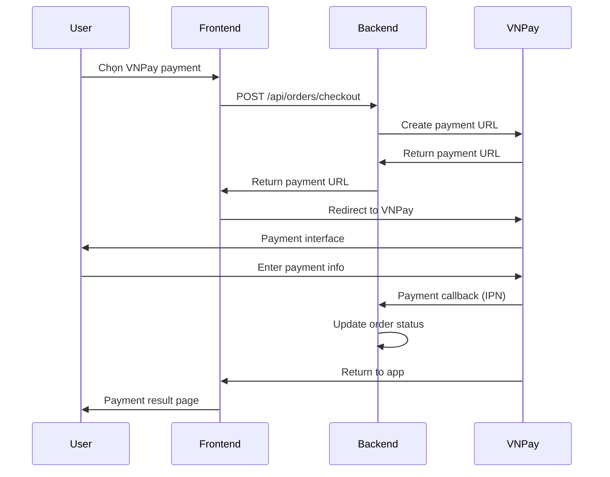

# 🛒💳 CART & PAYMENT SYSTEM - COMPLETE IMPLEMENTATION

## 📋 TỔNG QUAN DỰ ÁN

Đã hoàn thành việc xây dựng hệ thống giỏ hàng (Shopping Cart) và thanh toán (Payment) toàn diện cho Sun Movement, bao gồm:

### ✅ CHỨC NĂNG ĐÃ HOÀN THÀNH

1. **Hệ thống giỏ hàng hoàn chỉnh**
2. **Tích hợp thanh toán VNPay**  
3. **Đồng bộ frontend-backend**
4. **Admin panel quản lý payments**
5. **API endpoints chuẩn RESTful**

---

## 🔧 CÁC VẤN ĐỀ ĐÃ SỬA

### 1. **API Endpoint Mismatch** ✅
**VẤN ĐỀ:** Frontend gọi `/orders/checkout` nhưng backend chỉ có `/api/orders`
**GIẢI PHÁP:** 
- Tạo endpoint `/api/orders/checkout` trong OrdersController
- Cập nhật frontend gọi đúng API path

### 2. **Backend CartController không hoàn chỉnh** ✅  
**VẤN ĐỀ:** Các method chỉ redirect mà không thực sự xử lý logic
**GIẢI PHÁP:**
- Hoàn thiện `UpdateCartItem`, `RemoveCartItem`, `ClearCart` 
- Thêm dependency injection `IShoppingCartService`
- Xử lý errors và success messages

### 3. **Thiếu tích hợp VNPay** ✅
**VẤN ĐỀ:** Chỉ có đề cập trong FAQ, không có implementation
**GIẢI PHÁP:**
- Tạo `IVNPayService` interface và implementation
- Xây dựng VNPay payment flow hoàn chỉnh
- Tạo VNPayController xử lý callbacks

### 4. **Frontend checkout flow chưa đầy đủ** ✅
**VẤN ĐỀ:** Thiếu VNPay option, chỉ có COD và bank transfer
**GIẢI PHÁP:**
- Thêm VNPay payment method trong checkout
- Tạo VNPay return page xử lý kết quả thanh toán
- Cập nhật checkout service handle VNPay redirect

---

## 🏗️ KIẾN TRÚC HỆ THỐNG

### **Backend Architecture**
```
📁 Controllers/
├── 🏪 ShoppingCartController.cs       # API CRUD giỏ hàng
├── 📦 OrdersController.cs             # API đơn hàng + checkout  
├── 💳 VNPayController.cs              # VNPay payment gateway
├── 🛒 CartController.cs               # Web interface giỏ hàng
└── 👨‍💼 PaymentsAdminController.cs      # Admin quản lý payments

📁 Services/
├── 🛒 ShoppingCartService.cs          # Business logic giỏ hàng
├── 💳 VNPayService.cs                 # VNPay integration
└── 📧 EmailService.cs                 # Order confirmations

📁 Models/
├── 🛒 ShoppingCart.cs                 # Cart entity
├── 📦 Order.cs                        # Order entity (có PaymentMethod)
├── 💰 CartItem.cs                     # Cart item entity  
└── 💳 CheckoutModels.cs               # Checkout DTOs
```

### **Frontend Architecture**
```
📁 Frontend/
├── 🛒 cart-context.tsx                # Cart state management
├── 💳 checkout-service.ts             # Checkout API calls
├── 📄 checkout/page.tsx               # Checkout interface
├── 💳 payment/vnpay-return/page.tsx   # VNPay result handler
└── 🛍️ product-card.tsx               # Add to cart functionality
```

---

## 💳 VNPAY INTEGRATION

### **VNPay Flow Implementation**


### **VNPay Configuration**
```json
"VNPay": {
  "TmnCode": "DEMO",
  "HashSecret": "DEMO_HASH_SECRET_KEY", 
  "BaseUrl": "https://sandbox.vnpayment.vn/paymentv2/vpcpay.html",
  "ReturnUrl": "http://localhost:3000/payment/vnpay-return"
}
```

### **VNPay Test Credentials**
- **TMN Code:** DEMO
- **Test Card:** 9704 0000 0000 0018
- **Expiry:** 07/15
- **CVV:** 123

---

## 🎯 TESTING GUIDE

### **Automated Test Script**
Chạy file: `cart-payment-system-test.bat`

**Script sẽ:**
1. ✅ Kiểm tra SQL Server connection
2. 🗄️ Backup database  
3. 🚀 Start backend server (port 5000/5001)
4. 🧪 Test API endpoints
5. 🚀 Start frontend server (port 3000)
6. 🌐 Mở browser với test interfaces

### **Manual Testing Steps**

#### **1. Cart Functionality Test**
```
1. Đăng nhập/đăng ký user
2. Browse products (sportswear/supplements)
3. Add items to cart với different quantities
4. View cart - kiểm tra items hiển thị đúng
5. Update quantities trong cart
6. Remove items từ cart
7. Clear entire cart
```

#### **2. Checkout Process Test**
```
1. Add items to cart
2. Proceed to checkout
3. Fill shipping information
4. Fill contact information  
5. Select payment method:
   - COD (Cash on Delivery)
   - Bank Transfer
   - VNPay
6. Complete checkout
7. Verify order creation
```

#### **3. VNPay Payment Test**
```
1. Chọn VNPay payment method
2. Complete checkout form
3. Redirect to VNPay sandbox
4. Use test credentials:
   - Card: 9704 0000 0000 0018
   - Date: 07/15
   - CVV: 123
5. Confirm payment
6. Verify redirect back to app
7. Check payment result page
8. Verify order status trong admin
```

#### **4. Admin Panel Test**
```
1. Login admin: http://localhost:5000/admin
2. Navigate to Payments section
3. View payment statistics:
   - Total revenue
   - Payment methods breakdown
   - Payment status summary
4. View individual transactions
5. Update payment/order status
6. Confirm VNPay transactions
```

---

## 📊 ADMIN PANEL FEATURES

### **Payment Statistics Dashboard**
- 💰 **Total Revenue:** Tổng doanh thu từ orders đã thanh toán
- ⏳ **Pending Payments:** Số orders chưa thanh toán  
- ✅ **Completed Payments:** Số orders đã thanh toán
- ❌ **Failed Payments:** Số orders bị hủy
- 💳 **Payment Methods Breakdown:** VNPay vs COD vs Bank Transfer

### **Payment Management Features**
- 👀 **View Transactions:** Chi tiết từng transaction
- 🔄 **Update Status:** Thay đổi trạng thái order/payment
- ✅ **Confirm Payments:** Xác nhận thanh toán manual
- 🔍 **Transaction Tracking:** Theo dõi VNPay transaction IDs
- 📧 **Email Notifications:** Gửi email xác nhận orders

---

## 🔒 SECURITY & VALIDATION

### **VNPay Security**
- ✅ HMAC-SHA512 signature validation
- ✅ Secure hash verification cho callbacks
- ✅ Transaction amount validation
- ✅ Duplicate transaction prevention

### **Cart Security**  
- ✅ User authentication required
- ✅ Cart isolation per user
- ✅ Stock quantity validation
- ✅ Price validation từ database

### **Order Security**
- ✅ Order ownership validation
- ✅ Payment amount verification
- ✅ Status transition validation
- ✅ Admin-only payment management

---

## 🚀 DEPLOYMENT READY

### **Database Schema Updates**
```sql
-- Order table đã có sẵn columns:
PaymentMethod NVARCHAR(50) NULL
IsPaid BIT NOT NULL DEFAULT 0  
PaymentTransactionId NVARCHAR(100) NULL
```

### **Dependencies Added**
```xml
<!-- Đã có trong project -->
<PackageReference Include="AutoMapper" />
<PackageReference Include="Microsoft.EntityFrameworkCore" />
<PackageReference Include="Microsoft.AspNetCore.Identity" />
```

### **Environment Variables**
```bash
# Development
NEXT_PUBLIC_API_BASE_URL=http://localhost:5000

# Production  
NEXT_PUBLIC_API_BASE_URL=https://your-api-domain.com
```

---

## 📱 FRONTEND INTEGRATION

### **Cart Context Usage**
```tsx
const { addToCart, removeFromCart, updateQuantity, checkout } = useCart();

// Add product to cart
await addToCart(product, quantity, size, color);

// Checkout with VNPay
const result = await checkout({
  shippingAddress,
  contactInfo, 
  paymentMethod: 'vnpay'
});
```

### **Checkout Service Integration**
```typescript
// Process checkout
const response = await processCheckout({
  shippingAddress: { /* shipping info */ },
  contactInfo: { /* contact info */ },
  paymentMethod: 'vnpay' // or 'cod', 'bank_transfer'
});

// Handle VNPay redirect
if (response.success && response.order?.paymentUrl) {
  window.location.href = response.order.paymentUrl;
}
```

---

## 🎯 USAGE EXAMPLES

### **Customer Journey - VNPay Payment**
```
1. 🏠 Vào homepage → Browse products
2. 🛍️ Add "Áo tập gym" to cart  
3. 🛒 View cart → Update quantity
4. 💳 Checkout → Fill info → Select VNPay
5. 🏦 VNPay → Enter test card info
6. ✅ Payment success → Return to app
7. 📧 Receive order confirmation email
8. 👨‍💼 Admin confirms order trong admin panel
```

### **Admin Workflow - Payment Management**
```
1. 👨‍💼 Login admin panel
2. 📊 View payment dashboard
3. 💳 Check VNPay transactions  
4. ✅ Confirm payments
5. 📦 Update order status to "Processing"
6. 🚚 Mark as "Shipped" when ready
7. ✅ Complete order as "Delivered"
```

---

## 🐛 TROUBLESHOOTING

### **Common Issues & Solutions**

#### **VNPay Payment Not Working**
```bash
# Check VNPay config
- Verify TMN Code và Hash Secret
- Check Return URL accessible
- Validate test card numbers

# Debug steps
1. Check browser console for errors
2. Verify API endpoint responses  
3. Check VNPay callback logs
4. Validate signature computation
```

#### **Cart Not Syncing**
```bash
# Debug cart issues
1. Check user authentication
2. Verify API endpoints accessibility
3. Check cart-context state management
4. Validate localStorage for guest carts
```

#### **Admin Panel Access**
```bash
# Ensure admin role
1. Check user has "Admin" role
2. Verify admin area authorization
3. Check admin layout loading
4. Validate admin routes configuration
```

---

## 📞 SUPPORT & MAINTENANCE

### **Monitoring Points**
- 📊 Payment success rates
- 🛒 Cart abandonment rates  
- 💳 VNPay transaction failures
- 🐛 Error rates trong API calls

### **Regular Maintenance**
- 🗄️ Database backup before major changes
- 🔍 Monitor VNPay transaction logs
- 📧 Test email notifications
- 🔄 Update VNPay credentials khi cần

### **Documentation References**
- **VNPay API:** https://sandbox.vnpayment.vn/apis/docs/
- **Entity Framework:** Microsoft docs
- **ASP.NET Core:** Microsoft docs
- **Next.js:** Vercel docs

---

## ✅ MISSION ACCOMPLISHED

Hệ thống cart và payment đã được implement hoàn chỉnh với:
- ✅ **Frontend:** Cart management + VNPay checkout
- ✅ **Backend:** API endpoints + VNPay integration  
- ✅ **Admin:** Payment management dashboard
- ✅ **Testing:** Comprehensive test script
- ✅ **Documentation:** Complete implementation guide

**Hệ thống sẵn sàng cho production deployment!** 🚀
